# Integrated Production Process

This draft defines a more integrated operating process for the AI cognition
compression project. It keeps the existing fidelity-first production pipeline,
but reduces chaos by making shared state, role lanes, decision gates, and
feedback loops explicit.

## Process Intent

The project should not behave like a long checklist where every role waits for
the previous role to finish. It should behave like a controlled production
system:

```text
source truth
-> selected mental upgrade
-> episode state
-> synchronized voice / visual / scene graph
-> render
-> package
-> platform feedback
```

The integrated process has four goals:

- Keep source truth stable.
- Let roles work in parallel when safe.
- Make the scene graph the integration hub earlier.
- Keep optional tasks, such as brand/source visual extraction, from polluting the
  core pipeline.

## Central State Artifact

Every new publishable episode should have one production-state file:

```text
handoff/<slug>.production-state.md
```

This file is the live control center for the episode. It should be updated when
major decisions change.

Minimum structure:

```markdown
# Production State

## Identity

- Slug:
- Topic:
- Series:
- Episode:
- Current stage:
- Lead:

## Objective

- Audience:
- Mental upgrade:
- Output target:
- Duration target:

## Source State

- Primary sources:
- Source qualification:
- Source logic / taxonomy gate:
- Non-cuttable source value:
- Open source questions:

## Episode State

- Episode promise:
- Compression level:
- Retained value:
- Moved value:
- Omitted value:
- Decision frame:

## Role Ownership

| Role | Owner | Current artifact | Status | Blockers |
|---|---|---|---|---|
| Lead |  |  |  |  |
| Knowledge |  |  |  |  |
| Voice |  |  |  |  |
| Visual Production |  |  |  |  |
| Quality |  |  |  |  |
| Douyin Platform |  |  |  |  |

## Visual State

- Visual system:
- Visual style approval:
- Brand/source extraction needed:
- Preview links:
- Scene graph visual notes:

## Voice State

- Script:
- Paragraph plan:
- Speech chunks:
- TTS:
- ASR:
- Voice manifest:

## Scene Graph State

- Draft scene graph:
- Source refs complete:
- Timing source:
- Focus sync status:

## Distribution State

- Video:
- Cover:
- Caption:
- Manifest:
- QA:
- Platform feedback:

## Decisions

| Date | Decision | Owner | Reason |
|---|---|---|---|

## Next Actions

1.
2.
3.
```

Why this exists:

- Chat is not durable state.
- Separate artifacts are not enough to tell the current production truth.
- Roles need one place to see what is approved, blocked, or outdated.

## Process Modes

Use the smallest process that protects the artifact.

### Mode A: Full Publishable Video

Use when creating or redoing a Douyin-ready video package.

```text
Lead Scope
-> Knowledge Truth Base
-> Episode Strategy
-> Compression / Value Budget
-> Draft Scene Graph
-> Voice Lane + Visual Lane
-> Integrated Scene Graph Lock
-> TTS / ASR / Timing
-> Remotion Render
-> QA / Release
-> Douyin Publish
-> Platform Feedback
```

### Mode B: Revision

Use when changing an existing video, cover, script, visual direction, or package.

```text
Lead Scope
-> Identify affected layers
-> Reopen only affected gates
-> Update production-state file
-> Revise artifacts
-> Run targeted QA
-> Update package / final index if needed
```

Examples:

- Script rewrite reopens compression, voice, scene graph, timing, render QA.
- Cover redesign reopens visual approval, cover render, package QA.
- Source correction reopens extraction, taxonomy, compression, script, scene graph.

### Mode C: Narrow Task

Use for role prompts, docs, diagrams, one-off review, or local cleanup.

```text
Scope
-> Edit relevant artifact
-> Run local check
-> Note impact
```

Do not trigger source scouting, visual extraction, TTS, or Remotion unless the
task actually touches those layers.

## Integrated Flow

```mermaid
flowchart TD
  A["Source or task trigger"] --> B["Lead scope"]
  B --> B1{"Choose mode"}

  B1 -->|"Full video"| C["Create / update handoff/<slug>.production-state.md"]
  B1 -->|"Revision"| C
  B1 -->|"Narrow task"| NT["Edit relevant artifact only"]

  C --> D["Knowledge truth base"]
  D --> D1["sources/<slug>.sources.md"]
  D --> D2["extraction/<slug>.source-map.md"]
  D2 --> E{"Source logic / taxonomy gate"}
  E -->|"Fail"| D
  E -->|"Pass"| F["Episode strategy"]

  F --> F1["synthesis/<slug>.brief.md"]
  F --> F2{"Series needed?"}
  F2 -->|"Yes"| F3["series/<slug>.series.md"]
  F2 -->|"No"| G["Compression / value budget"]
  F3 --> G
  G --> G1["compression/<slug>.md"]
  G1 --> H["Draft scene graph"]

  H --> H1["scene-graphs/<slug>.json<br/>draft sequence, claims, refs, focus intent"]
  H1 --> I["Parallel role lanes"]

  I --> V["Voice lane"]
  I --> VP["Visual lane"]
  I --> DP["Douyin platform lane"]
  I --> Q0["Quality early review"]

  V --> V1["script.md"]
  V1 --> V2["paragraph-plan.md"]
  V2 --> V3["speech-chunk-plan.md"]
  V3 --> V4{"Native Chinese gate"}

  VP --> VP0{"Style already locked?"}
  VP0 -->|"No, source/brand matters"| VP1["Optional brand/source visual extraction"]
  VP0 -->|"No, use template pool"| VP2["HTML visual previews"]
  VP0 -->|"Yes"| VP4["Scene visual notes"]
  VP1 --> VP2
  VP2 --> VP3{"Visual direction approval"}
  VP3 -->|"No"| VP2
  VP3 -->|"Yes"| VP4

  DP --> DP1["Hook hypothesis"]
  DP1 --> DP2["Cover/title/caption angle"]
  DP2 --> DP3["Retention risks"]

  Q0 --> Q1["Check source drift, density, expression, visual risks"]

  V4 -->|"Fail"| V1
  V4 -->|"Pass"| J["Integrated scene graph lock"]
  VP4 --> J
  DP3 --> J
  Q1 --> J
  H1 --> J

  J --> J1["scene graph has claims, subtitles, visual focus, source refs, draft timing"]
  J1 --> K["TTS production"]
  K --> K1["voice chunks + voiceover.final.mp3"]
  K1 --> K2["ASR validation"]
  K2 --> K3{"Voice naturalness / ASR gate"}
  K3 -->|"Fail"| V3
  K3 -->|"Pass"| L["Timing integration"]

  L --> L1["voice-manifest.json"]
  L1 --> L2["Update scene graph timing and focus sync"]
  L2 --> M["Remotion implementation"]
  M --> M1["stills / previews / contact sheet"]
  M1 --> M2{"Render QA gate"}
  M2 -->|"Fail"| L2
  M2 -->|"Pass"| N["Final render"]

  N --> N1["douyin/<slug>/video.mp4"]
  N --> N2["douyin/<slug>/cover.png"]
  N1 --> O["Package QA"]
  N2 --> O
  O --> O1["qa.md, manifest.md, caption.md, cover.md"]
  O1 --> P{"Release verification"}
  P -->|"Fail"| O
  P -->|"Pass"| R["final/<slug>.md"]
  R --> S["Douyin publish"]
  S --> S1["douyin/<slug>/platform.md"]
  S1 --> T["Performance feedback"]
  T --> U{"Iteration needed?"}
  U -->|"No"| Z["Archive shipped state"]
  U -->|"Packaging"| DP
  U -->|"Hook / cover"| VP
  U -->|"Script / logic"| F
  U -->|"Source issue"| D
```



## Role Lanes

### Lead Lane

Owns:

- Production-state file.
- Mode selection.
- Scope control.
- File ownership.
- Conflict resolution.
- Final integration.

Lead decisions:

- Is this full video, revision, or narrow task?
- Which gates are required?
- Which role owns each artifact?
- Is the project blocked by missing source, unclear style, or missing approval?

Lead output:

```text
handoff/<slug>.production-state.md
```

### Knowledge Lane

Owns:

- Source qualification.
- Source value inventory.
- Source map.
- Taxonomy gate.
- Synthesis.
- Series split.
- Episode promise.
- Value budget.
- Compression.

Knowledge must protect:

- Source-defined categories.
- Important caveats.
- Non-cuttable diagrams, examples, metrics, and terms.
- Clear separation between source truth and synthesis.

Knowledge outputs:

```text
sources/<slug>.sources.md
extraction/<slug>.source-map.md
synthesis/<slug>.brief.md
series/<slug>.series.md
compression/<slug>.md
```

### Voice Lane

Owns:

- Natural Chinese script.
- Paragraph plan.
- Speech chunks.
- Pronunciation.
- TTS.
- ASR validation.
- Voice manifest.

Voice enters after compression, but before visual lock is final. Voice should
challenge compression if the spoken version becomes too dense.

Voice outputs:

```text
voice/<slug>/script.md
voice/<slug>/paragraph-plan.md
voice/<slug>/speech-chunk-plan.md
voice/<slug>/pronunciation.md
voice/<slug>/chunks/*.mp3
voice/<slug>/voiceover.final.mp3
voice/<slug>/asr.txt
voice/<slug>/voice-manifest.json
voice/<slug>/qa.md
```

### Visual Production Lane

Owns:

- Visual system selection.
- Optional brand/source visual extraction.
- HTML previews.
- Motion prototype.
- Scene graph visual mapping.
- Remotion components.
- Subtitles.
- Covers.
- Stills and contact sheets.
- Final render.

Visual Production should not ingest source brands by default. Run brand/source
visual extraction only when it changes visual trust, endorsement risk, diagram
treatment, or template selection.

Visual outputs:

```text
review/<slug>.source-visual-inventory.md  # optional
presentation/<slug>*.html
scene-graphs/<slug>.json
remotion/src/*
douyin/<slug>/video.mp4
douyin/<slug>/cover.png
douyin/<slug>/contact-sheet.jpg
```

### Quality Lane

Owns:

- Source fidelity review.
- Taxonomy review.
- Compression risk review.
- Native expression review.
- Voice-frame sync review.
- Render QA.
- Package verification.
- Final index check.

Quality should work in two passes:

1. Early lightweight review before expensive production.
2. Final release verification after render and package assembly.

Quality outputs:

```text
review/<slug>.findings.md
douyin/<slug>/qa.md
douyin/<slug>/manifest.md
final/<slug>.md
```

### Douyin Platform Lane

Owns:

- Hook hypothesis.
- Title and caption experiments.
- Cover angle.
- Retention risk.
- Publish timing.
- Metrics.
- Follower conversion.
- Engagement feedback.
- Iteration recommendation.

Douyin Platform enters at episode strategy, not only after rendering.

Douyin Platform can optimize packaging, but cannot override source truth.

Douyin outputs:

```text
douyin/<slug>/caption.md
douyin/<slug>/platform.md
```

## Gate Model

Use fewer hard gates. Treat the rest as checkpoints.

### Hard Gates

These block downstream production.

| Gate | Blocks | Why |
|---|---|---|
| Source qualification | Extraction and compression | Prevents building on weak sources. |
| Source logic / taxonomy | Compression, script, cover, render | Prevents false mental models. |
| Native Chinese expression | TTS, subtitle lock, cover final | Prevents translation-shaped output. |
| Voice naturalness / ASR | Final timing and render | Prevents bad audio and wrong subtitles. |
| Render QA | Distribution | Prevents broken video packages. |
| Release verification | Publish / final index | Prevents incomplete shipped state. |

### Review Checkpoints

These guide work but do not always block.

| Checkpoint | Owner | Purpose |
|---|---|---|
| Series / episode scope | Lead + Knowledge | Decide whether to split before over-compressing. |
| Value budget | Knowledge + Voice | Prevent loss of non-cuttable source value. |
| Visual style exploration | Visual Production | Compare directions before Remotion. |
| Brand/source visual extraction | Visual Production | Optional style and endorsement-risk input. |
| Douyin hook review | Douyin Platform | Improve feed performance without changing truth. |
| Early quality review | Quality | Catch drift before expensive render. |

## Artifact Order

For full publishable video:

```text
handoff/<slug>.production-state.md
sources/<slug>.sources.md
extraction/<slug>.source-map.md
synthesis/<slug>.brief.md
series/<slug>.series.md              # when needed
compression/<slug>.md
scene-graphs/<slug>.json             # draft early, lock later
voice/<slug>/script.md
voice/<slug>/paragraph-plan.md
voice/<slug>/speech-chunk-plan.md
presentation/<slug>*.html            # previews / visual board
review/<slug>.source-visual-inventory.md  # optional
voice/<slug>/voice-manifest.json
voice/<slug>/qa.md
douyin/<slug>/video.mp4
douyin/<slug>/cover.png
douyin/<slug>/caption.md
douyin/<slug>/cover.md
douyin/<slug>/manifest.md
douyin/<slug>/qa.md
final/<slug>.md
douyin/<slug>/platform.md            # after publish
```

Important change:

- `scene-graphs/<slug>.json` starts as a draft immediately after compression.
- It becomes final only after voice, visual, source refs, and measured timing are
  integrated.

## Optional Brand / Source Visual Extraction

This is a Visual Production subprocess, not a project-wide gate.

Run it when:

- The visual style is undecided.
- The source has meaningful visual identity.
- The source includes diagrams, product UI, screenshots, logos, website design,
  report layout, or brand assets.
- Endorsement risk matters.
- The user asks to extract a source brand or reference style.

Skip it when:

- The task is not visual-production work.
- The visual system is already locked.
- The source has no meaningful visual identity.
- The task is a narrow copy, voice, QA, package, or render fix.

Output:

```text
review/<slug>.source-visual-inventory.md
```

This artifact should feed template comparison and visual-system design. It should
not automatically create a final brand style.

## Scene Graph As Integration Hub

The scene graph should carry:

- scene order
- source-faithful claims
- subtitles
- voice paragraph IDs
- source refs
- visual focus moments
- artifact references
- timing intent
- measured duration updates
- motion cues

Draft shape:

```json
{
  "slug": "topic-slug",
  "stage": "draft",
  "visualSystem": "pending",
  "durationTarget": 90,
  "scenes": []
}
```

Locked shape:

```json
{
  "slug": "topic-slug",
  "stage": "locked",
  "visualSystem": "systems-control-room",
  "durationTarget": 90,
  "voiceManifest": "voice/topic-slug/voice-manifest.json",
  "scenes": [
    {
      "id": "s01",
      "sectionLabel": "Decision Frame",
      "claim": "One source-faithful claim.",
      "paragraphId": "p01",
      "sourceRefs": ["source:p12"],
      "beats": [
        {
          "id": "b01",
          "voice": "Spoken narration.",
          "subtitle": "Burned-in subtitle.",
          "focus": ["quality-gate"],
          "focusPhrase": "quality gate",
          "focusCue": "outline",
          "startMs": 0,
          "durationMs": 3200
        }
      ]
    }
  ]
}
```

## Role Opinion Protocol

When the process is uncertain, ask each role for a short opinion using this
format:

```markdown
## Role Opinions

### Lead
- Concern:
- Recommendation:
- Risk if ignored:

### Knowledge
- Concern:
- Recommendation:
- Risk if ignored:

### Voice
- Concern:
- Recommendation:
- Risk if ignored:

### Visual Production
- Concern:
- Recommendation:
- Risk if ignored:

### Quality
- Concern:
- Recommendation:
- Risk if ignored:

### Douyin Platform
- Concern:
- Recommendation:
- Risk if ignored:
```

Then Lead decides:

```markdown
## Lead Decision

- Decision:
- Reason:
- Affected artifacts:
- Gates to rerun:
- Next action:
```

## Feedback Loop Rules

Platform feedback can trigger iteration, but it cannot override source truth.

Use this routing:

| Feedback | Reopen |
|---|---|
| Low completion rate in first 3 seconds | Douyin hook + Visual opening + Voice first paragraph |
| Cover low click-through | Visual cover + Douyin title angle |
| Comments show misunderstanding | Knowledge compression + Voice expression + Scene graph |
| Source challenge / factual dispute | Source qualification + extraction + taxonomy gate |
| Subtitles hard to read | Visual Production + Render QA |
| Voice feels unnatural | Voice script + speech chunks + TTS / ASR |
| Video feels too dense | Series scope + value budget + compression |
| Good engagement but low follows | Douyin platform CTA + episode series promise |

## Stable Operating Rule

The integrated process should protect this hierarchy:

```text
source truth
> mental upgrade
> voice clarity
> visual clarity
> motion polish
> platform performance
```

Performance matters, but not at the cost of truth.
