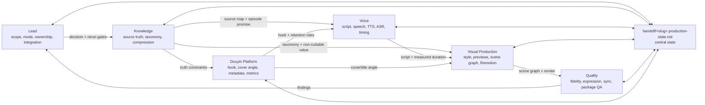
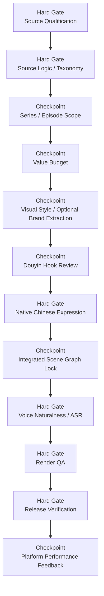
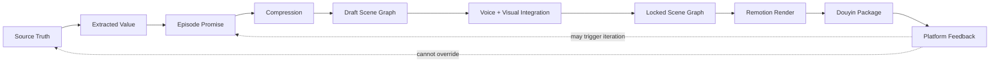

# Integrated Process Diagram

This diagram shows the optimized process as an integrated production system:
one central state file, parallel role lanes, early scene graph integration, and
platform feedback loops.

## System Overview

```mermaid
flowchart TD
  A["Task / Source Trigger"] --> B["Lead Scope"]
  B --> C{"Process Mode"}

  C -->|"Full Video"| S["Create / Update<br/>handoff/&lt;slug&gt;.production-state.md"]
  C -->|"Revision"| S
  C -->|"Narrow Task"| NT["Relevant Artifact Only<br/>targeted edit + local check"]

  S --> K["Knowledge Truth Base"]
  K --> K1["sources/&lt;slug&gt;.sources.md"]
  K --> K2["extraction/&lt;slug&gt;.source-map.md"]
  K2 --> G1{"Source Logic / Taxonomy Gate"}
  G1 -->|"Fail"| K
  G1 -->|"Pass"| ES["Episode Strategy"]

  ES --> SY["synthesis/&lt;slug&gt;.brief.md"]
  ES --> SGATE{"Series Needed?"}
  SGATE -->|"Yes"| SER["series/&lt;slug&gt;.series.md"]
  SGATE -->|"No"| CMB["Compression / Value Budget"]
  SER --> CMB
  CMB --> CM["compression/&lt;slug&gt;.md"]
  CM --> DSG["Draft Scene Graph<br/>scene-graphs/&lt;slug&gt;.json"]

  DSG --> LANES["Parallel Production Lanes"]

  LANES --> V["Voice Lane"]
  LANES --> VIS["Visual Production Lane"]
  LANES --> DY["Douyin Platform Lane"]
  LANES --> QA0["Quality Early Review"]

  V --> V1["Script"]
  V1 --> V2["Paragraph Plan"]
  V2 --> V3["Speech Chunks"]
  V3 --> VG{"Native Chinese Gate"}
  VG -->|"Fail"| V1

  VIS --> VS0{"Visual Style Locked?"}
  VS0 -->|"No + source/brand matters"| BSE["Optional Brand / Source<br/>Visual Extraction"]
  VS0 -->|"No"| PRE["HTML Previews"]
  VS0 -->|"Yes"| VNOTE["Visual Notes For Scene Graph"]
  BSE --> PRE
  PRE --> VAPP{"Visual Direction Approval"}
  VAPP -->|"No"| PRE
  VAPP -->|"Yes"| VNOTE

  DY --> DY1["Hook Hypothesis"]
  DY1 --> DY2["Cover / Title / Caption Angle"]
  DY2 --> DY3["Retention Risk"]

  QA0 --> QA1["Check drift, density,<br/>expression, visual risks"]

  VG -->|"Pass"| LOCK["Integrated Scene Graph Lock"]
  VNOTE --> LOCK
  DY3 --> LOCK
  QA1 --> LOCK
  DSG --> LOCK

  LOCK --> LSG["Locked Scene Graph<br/>claims + subtitles + refs + focus cues"]
  LSG --> TTS["TTS Production"]
  TTS --> ASR["ASR Validation"]
  ASR --> VG2{"Voice Naturalness / ASR Gate"}
  VG2 -->|"Fail"| V3
  VG2 -->|"Pass"| TIME["Timing Integration"]

  TIME --> VM["voice-manifest.json"]
  VM --> SYNC["Motion / Focus Sync"]
  SYNC --> REM["Remotion Implementation"]
  REM --> PREVIEW["Stills / Contact Sheet"]
  PREVIEW --> RQA{"Render QA Gate"}
  RQA -->|"Fail"| SYNC
  RQA -->|"Pass"| RENDER["Final Render"]

  RENDER --> VID["douyin/&lt;slug&gt;/video.mp4"]
  RENDER --> COV["douyin/&lt;slug&gt;/cover.png"]
  VID --> PKG["Package QA"]
  COV --> PKG
  PKG --> DOCS["qa.md + manifest.md<br/>caption.md + cover.md"]
  DOCS --> REL{"Release Verification"}
  REL -->|"Fail"| PKG
  REL -->|"Pass"| FIN["final/&lt;slug&gt;.md"]

  FIN --> PUB["Douyin Publish"]
  PUB --> PERF["douyin/&lt;slug&gt;/platform.md<br/>performance feedback"]
  PERF --> ITER{"Iteration Needed?"}

  ITER -->|"No"| DONE["Archive Shipped State"]
  ITER -->|"Packaging / Metadata"| DY
  ITER -->|"Hook / Cover"| VIS
  ITER -->|"Script / Logic"| ES
  ITER -->|"Source Issue"| K
```

## Role Interaction Map

## Gate Model

## Source Of Truth Flow

