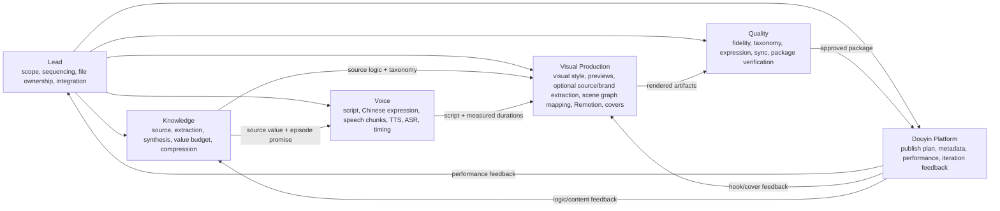
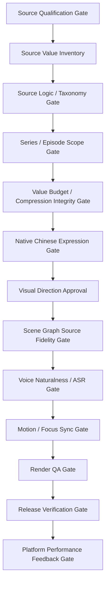
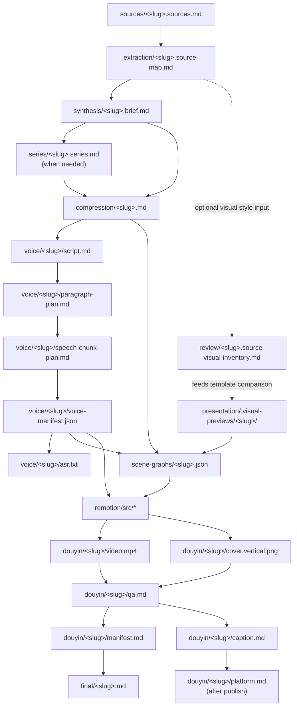
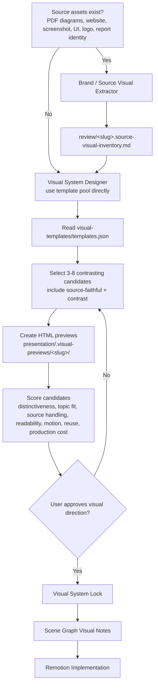
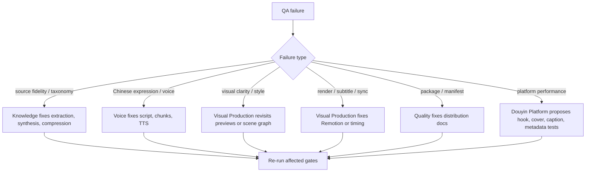

# Project Process Diagram

This draft maps the full AI cognition compression production process from source intake to Douyin performance feedback.

## End-To-End Flow

```mermaid
flowchart TD
  A["Source Trigger<br/>topic, PDF, article, paper, doc, product UI, user request"] --> B["Lead<br/>Scope task and assign owners"]

  B --> C["Knowledge<br/>Source Scouting"]
  C --> C1["sources/&lt;slug&gt;.sources.md<br/>links, provenance, local copies, freshness notes"]
  C1 --> D{"Source Qualification Gate"}
  D -- "Fail" --> D1["Reject or request better source"]
  D -- "Pass" --> E["Knowledge<br/>Source Value Inventory"]

  E --> E1["extraction/&lt;slug&gt;.source-map.md<br/>claims, diagrams, metrics, caveats, taxonomy, non-cuttable value"]
  E1 --> F{"Source Logic / Taxonomy Gate"}
  F -- "Fail" --> F1["Fix extraction or split source logic"]
  F1 --> E
  F -- "Pass / Pass with caveats" --> H["Knowledge<br/>Synthesis"]

  H --> H1["synthesis/&lt;slug&gt;.brief.md<br/>candidate mental upgrades, source logic, narrative structure"]
  H1 --> I{"Series / Episode Scope Gate"}
  I -- "One mental upgrade" --> J["Episode Strategy"]
  I -- "Multiple mental upgrades" --> I1["series/&lt;slug&gt;.series.md<br/>episode split, keep/move/defer table, cover anchors"]
  I1 --> J

  J --> J1["compression/&lt;slug&gt;.md<br/>episode promise, audience, decision frame"]
  J1 --> K["Knowledge<br/>Value Budget"]
  K --> K1["Retained / moved / omitted / non-cuttable value<br/>compression level: short, standard, deep technical"]
  K1 --> L{"Compression Integrity Gate"}
  L -- "Too dense" --> I
  L -- "Pass" --> M["Voice<br/>Script Draft"]

  M --> M1["voice/&lt;slug&gt;/script.md<br/>natural Chinese narration"]
  M1 --> N["Voice<br/>Paragraph Voice Design"]
  N --> N1["voice/&lt;slug&gt;/paragraph-plan.md<br/>one idea, intention, pacing, visual focus per paragraph"]
  N1 --> O["Voice<br/>Speech Chunk Design"]
  O --> O1["voice/&lt;slug&gt;/speech-chunk-plan.md<br/>performable chunks, pauses, emphasis, pronunciation notes"]
  O1 --> P{"Native Chinese Expression Gate"}
  P -- "Fail / fixes" --> M
  P -- "Pass" --> Q0{"Style needs source / brand extraction?"}

  Q0 -->|Yes| Q00["Visual Production<br/>Brand / Source Visual Extraction<br/>(optional style-setting task)"]
  Q0 -->|No| Q
  Q00 --> Q01["review/&lt;slug&gt;.source-visual-inventory.md<br/>optional: source visual tokens, asset rules, endorsement risks, template fit"]
  Q01 --> Q
  Q --> Q1["presentation/.visual-previews/&lt;slug&gt;/<br/>3+ HTML previews or full template board"]
  Q1 --> R{"Visual Direction Approval"}
  R -- "Not approved" --> Q
  R -- "Approved" --> R1["Visual System Lock<br/>style name, typography, palette, layout grammar, motion, source guardrails"]

  R1 --> S["Visual Production + Voice<br/>Scene Graph Planning"]
  O1 --> S
  K1 --> S
  S --> S1["scene-graphs/&lt;slug&gt;.json<br/>scene order, claims, subtitles, artifacts, sources, focus cues, timing intent"]
  S1 --> T{"Source Fidelity Gate For Scene Graph"}
  T -- "Fail" --> S
  T -- "Pass" --> U["Voice<br/>TTS Production"]

  U --> U1["voice/&lt;slug&gt;/chunks/*.mp3<br/>voice-manifest.json timing updates"]
  U1 --> V["Voice<br/>ASR Validation"]
  V --> V1["voice/&lt;slug&gt;/asr.txt<br/>voice-manifest.json asrStatus"]
  V1 --> W{"Voice Naturalness / ASR Gate"}
  W -- "Fail" --> O
  W -- "Pass" --> X["Visual Production<br/>Motion / Focus Sync"]

  X --> X1["Update scene graph timing from measured voice durations<br/>map spoken focus to visual focus state"]
  X1 --> Y["Visual Production<br/>React / Remotion Components"]
  Y --> Y1["remotion/src/<br/>components, compositions, covers, subtitle-safe layouts"]
  Y1 --> Z["Visual Production<br/>Render Previews / Stills / Contact Sheet"]
  Z --> Z1["douyin/&lt;slug&gt;/cover.preview.png<br/>contact-sheet or sampled stills"]
  Z1 --> AA{"Render QA Gate"}
  AA -- "Fail" --> X
  AA -- "Pass" --> AB["Visual Production<br/>Final Remotion Rendering"]

  AB --> AB1["douyin/&lt;slug&gt;/video.mp4<br/>burned-in subtitles"]
  AB --> AB2["douyin/&lt;slug&gt;/cover.vertical.png or cover.png"]
  AB1 --> AC["Quality<br/>Package QA"]
  AB2 --> AC

  AC --> AC1["douyin/&lt;slug&gt;/qa.md<br/>fidelity, taxonomy, voice-frame sync, cover, subtitle, render checks"]
  AC --> AC2["douyin/&lt;slug&gt;/manifest.md<br/>artifact list, commands, duration, checksums"]
  AC --> AC3["douyin/&lt;slug&gt;/caption.md<br/>publish copy"]
  AC --> AC4["douyin/&lt;slug&gt;/cover.md<br/>cover logic"]
  AC1 --> AD{"Release Verification Gate"}
  AC2 --> AD
  AC3 --> AD
  AC4 --> AD

  AD -- "Fail" --> AC
  AD -- "Pass" --> AE["final/&lt;slug&gt;.md<br/>shipped artifact index"]
  AE --> AF["Douyin Platform<br/>Publish / Metadata Experiments"]
  AF --> AF1["douyin/&lt;slug&gt;/platform.md<br/>title, caption, tags, publish time, views, followers, engagement, retention"]
  AF1 --> AG["Performance Feedback"]
  AG --> AG1{"Iteration Needed?"}
  AG1 -- "No" --> AH["Archive as shipped package"]
  AG1 -- "Yes: packaging/caption" --> AF
  AG1 -- "Yes: hook/cover" --> Q
  AG1 -- "Yes: script/logic" --> J
  AG1 -- "Yes: source issue" --> C
```



## Role Ownership Map



## Gate Sequence



## Artifact Lifecycle



## Visual Decision Subprocess



## Feedback Loops



## Stable Rule

The source of truth flows downward:

```text
source truth
-> extracted value
-> episode promise
-> voice
-> scene graph
-> Remotion render
-> Douyin package
-> platform feedback
```

Platform feedback can trigger iteration, but it cannot override source truth.
